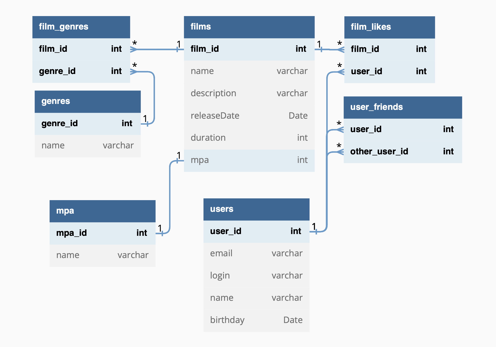

# java-filmorate
[//]: # (Template repository for Filmorate project.)
###### ER-диаграмма, описывающая связь таблиц в БД прлиложения *Filmorate*


###### Примеры CRUD-запросов.
```postgresql
-- create
INSERT INTO users(user_id, email, login, name, birthday)
VALUES(?, ?, ?, ?, ?);

-- read
SELECT *
FROM users AS u
WHERE u.user_id = ?;

-- update
UPDATE users set user_id = ?, email = ? , login = ?, name = ?, birthday = ? 
WHERE user_id = ?;

-- delete
DELETE FROM users 
WHERE user_id = ?
```